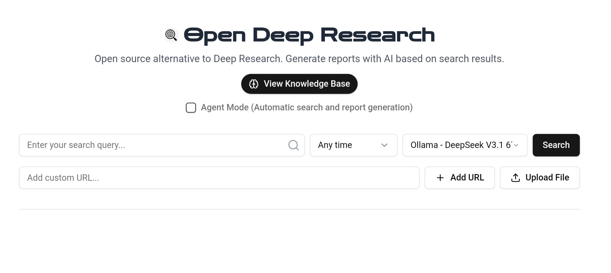
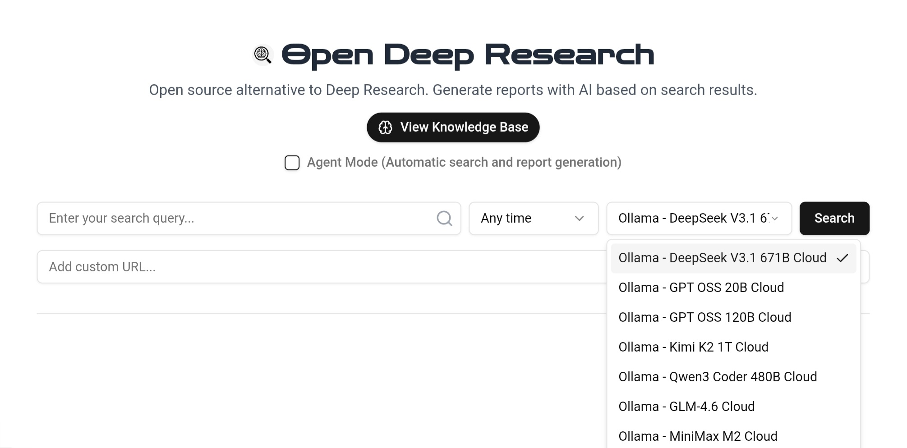

# Open Deep Research

A research assistant that generates reports from web search results. This version uses DuckDuckGo for web search and cloud AI models via Ollama, providing research capabilities without external API dependencies.

## How It Works

It works in 4 simple steps:

1. **Search**: DuckDuckGo finds relevant results for your query
2. **Extract**: Get the content from selected web pages
3. **Generate**: Create reports using cloud AI models
4. **Save**: Keep reports in your local knowledge base

Open Deep Research helps streamline research and report creation in an easy-to-use platform. All AI models are cloud-based through Ollama.

## Features

- Web search with DuckDuckGo
- Time-based filtering of search results
- Content extraction from web pages
- Cloud AI models via Ollama
- Multiple model options available
- Multiple export formats (PDF, Word, Text)
- Knowledge Base for saving and accessing reports

### Local Files

You can upload and analyze local files:

- Upload TXT, PDF, and DOCX files
- Work with local documents alongside web search
- Generate reports without searching the web
- Mix local files with web sources

**To use local files:**

1. Click the upload button in the search interface
2. Select your file (supported formats: TXT, PDF, DOCX)
3. The file will appear as a custom source in your results
4. Select it to analyze its contents

### Knowledge Base

The Knowledge Base feature allows you to:

- Save generated reports for future reference (reports are saved in the browser's local storage)
- Access your research history
- Quickly load and review past reports
- Build a personal research library over time

**Reports saved include:**

- Full report content
- Original search query and prompt
- Source URLs and references
- When the report was generated

Access the Knowledge Base via the button in the UI - it opens a sidebar with all saved reports.

## Installation

### Prerequisites

1. Create an account at [Ollama](https://ollama.com)
2. Verify your email
3. Have your login ready

### Manual Installation

#### Linux & macOS

```bash
curl -fsSL https://ollama.com/install.sh | sh
```

#### Windows

Download from https://ollama.com/download/windows

### Setup & Login

#### Initial Setup & Authentication

**Step 1: Start Ollama Server**

```bash
# Terminal 1 - Start the server
ollama serve
```

**Step 2: Device Pairing & Login**

```bash
# Terminal 2 - Sign in to your Ollama account
ollama signin
```

**Follow these steps after running the command:**

1. You'll receive a unique authentication URL
2. Open the URL in your browser
3. You'll see: "Connect device - This device will be paired with your account"
4. Click the "Connect" button
5. Return to terminal - authentication complete!

### Development Setup

#### Step 3: Clone & Setup

1. **Clone the repository:**

```bash
git clone https://github.com/AL-MARID/open-deep-research
cd open-deep-research
```

2. **Install dependencies:**

```bash
npm install
# or
pnpm install
# or
yarn install
```

3. **Build the project:**

```bash
pnpm build
```

4. Make sure Ollama is running and logged in
5. That's it - no API keys needed!

### Run the App

```bash
npm run dev
# or
pnpm dev
```

Visit `localhost:3000` in your browser.

## Configuration

You can modify settings in `lib/config.ts`:

### Search Settings

```typescript
search: {
  resultsPerPage: 10,
  maxSelectableResults: 3,
  provider: 'duckduckgo', // Only DuckDuckGo
}
```

### AI Models

Cloud models via Ollama:

```typescript
platforms: {
  ollama: {
    enabled: true,
    models: {
      'deepseek-v3.1:671b-cloud': { enabled: true },
      'gpt-oss:20b-cloud': { enabled: true },
      'gpt-oss:120b-cloud': { enabled: true },
      'kimi-k2:1t-cloud': { enabled: true },
      'qwen3-coder:480b-cloud': { enabled: true },
      'glm-4.6:cloud': { enabled: true },
      'minimax-m2:cloud': { enabled: true },
    },
  },
}
```

## Tech Stack

- [Next.js 15](https://nextjs.org/) - React framework
- [TypeScript](https://www.typescriptlang.org/) - Type safety
- [Tailwind CSS](https://tailwindcss.com/) - Styling
- [shadcn/ui](https://ui.shadcn.com/) - UI components
- [JinaAI](https://jina.ai/) - Content extraction
- [DuckDuckGo](https://duckduckgo.com/) - Free web search
- [Ollama](https://ollama.ai/) - Cloud AI models
- [jsPDF](https://github.com/parallax/jsPDF) & [docx](https://github.com/dolanmiu/docx) - Document generation

The app uses DuckDuckGo for web search and Ollama for cloud AI processing.

## Contributing

Contributions are welcome! If you have suggestions for improvements, new features, or bug fixes, please feel free to:

1. Fork the repository
2. Create a new branch (`git checkout -b feature/YourFeature`)
3. Make your changes and commit them (`git commit -m 'Add some feature'`)
4. Push to the branch (`git push origin feature/YourFeature`)
5. Open a Pull Request

## License

Copyright (c) 2025 AL-MARID

Permission is hereby granted, free of charge, to any person obtaining a copy of this software and associated documentation files (the "Software"), to deal in the Software without restriction, including without limitation the rights to use, copy, modify, merge, publish, distribute, sublicense, and/or sell copies of the Software, and to permit persons to whom the Software is furnished to do so, subject to the following conditions:

The above copyright notice and this permission notice shall be included in all copies or substantial portions of the Software.

THE SOFTWARE IS PROVIDED "AS IS", WITHOUT WARRANTY OF ANY KIND, EXPRESS OR IMPLIED, INCLUDING BUT NOT LIMITED TO THE WARRANTIES OF MERCHANTABILITY, FITNESS FOR A PARTICULAR PURPOSE AND NONINFRINGEMENT. IN NO EVENT SHALL THE AUTHORS OR COPYRIGHT HOLDERS BE LIABLE FOR ANY CLAIM, DAMAGES OR OTHER LIABILITY, WHETHER IN AN ACTION OF CONTRACT, TORT OR OTHERWISE, ARISING FROM, OUT OF OR IN CONNECTION WITH THE SOFTWARE OR THE USE OR OTHER DEALINGS IN THE SOFTWARE.

[MIT](https://github.com/AL-MARID/open-deep-research/blob/main/LICENSE)

## Follow AL-MARID

Stay connected and follow updates:

[](https://t.me/al_marid_1)
[](https://instagram.com/al_marid_.1)
